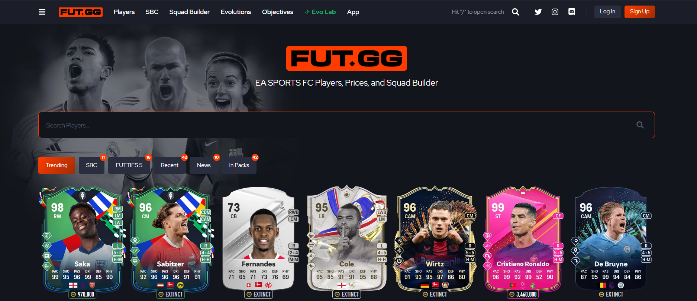

# FIFA 24 Players Web Scraping



## Project Date: 20-10-2023

This project demonstrates how to scrape FIFA 24 player information using BeautifulSoup, requests, and CSV modules. The script collects various player details and saves them into a CSV file for further analysis.

## Overview

The script scrapes player information such as player ID, name, card title, club, nation, league, foot, skill moves, weak foot, AcceleRATE, height, attacking/defensive work rate, age, player card image, player card link, and several other attributes from the FIFA 24 players database. The collected data is stored in a CSV file for further analysis.


## Technologies Used

- Python
- BeautifulSoup
- requests
- csv
- itertools
- time

## How to Use

1. Clone the repository and navigate to the project directory.
2. Install the required dependencies:
    ```bash
    pip install beautifulsoup4 requests
    ```
3. Run the scraping script:
    ```bash
    python web_scraping_fifa.py
    ```

## Script Explanation

1. **Import Modules**: The script imports necessary modules like `csv`, `BeautifulSoup`, `requests`, etc.
2. **Initialize Lists**: Empty lists are initialized to store the scraped data.
3. **Scrape Player Data**: The script loops through the pages of the FIFA 24 players' database and scrapes the relevant player information.
4. **Parse HTML**: Uses BeautifulSoup to parse the HTML content of each player's page.
5. **Extract Data**: Extracts player information, including the attributes shown in the screenshots, and appends it to the respective lists.
6. **Export to CSV**: Exports the scraped data to a CSV file.

## Sample Output

The output CSV file contains the following columns:
- Player ID
- Name
- Card Title
- Club
- Nation
- League
- Foot
- Skill Moves
- Weak Foot
- AcceleRATE
- Height
- Att/Def. WR
- Age
- Player Card Image
- Player Card Link
- Pace
- Shooting
- Passing
- Dribbling
- Defending
- Physicality

## Project Link

For more details and the source code, visit the [GitHub repository](https://github.com/AbdooMohamedd/BeautifulSoup-Web-Scraping-Projects/tree/main/Web%20Scraping%20FIFA%202024%20all%20Players).
